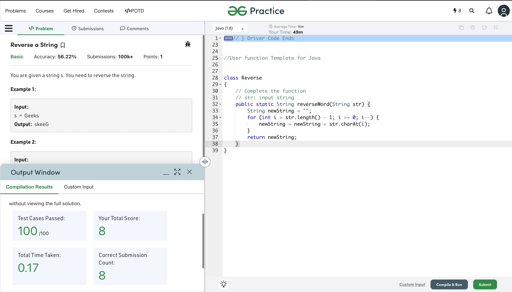
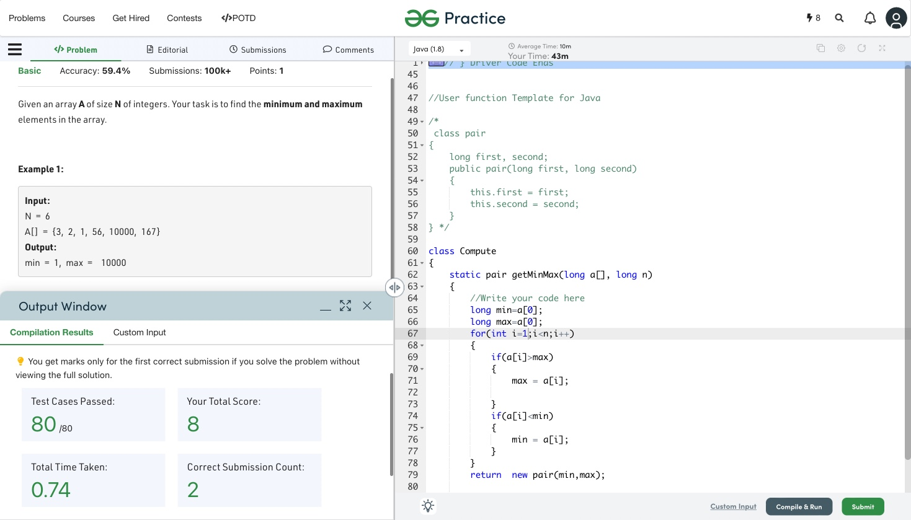
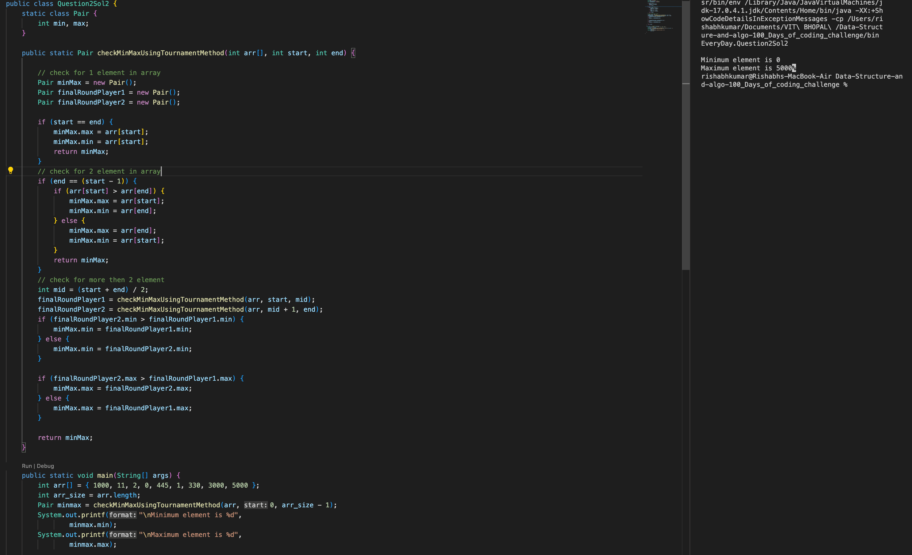
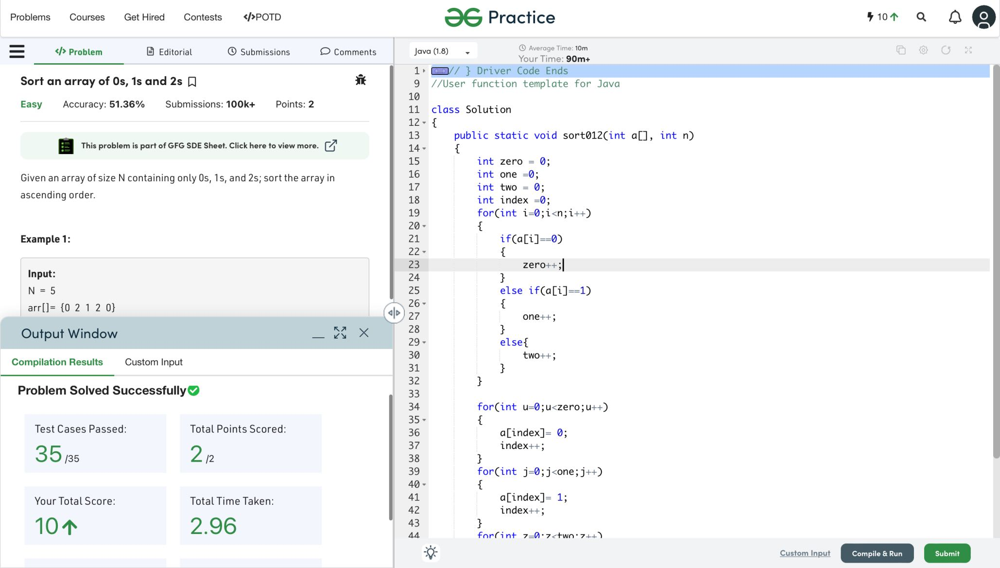
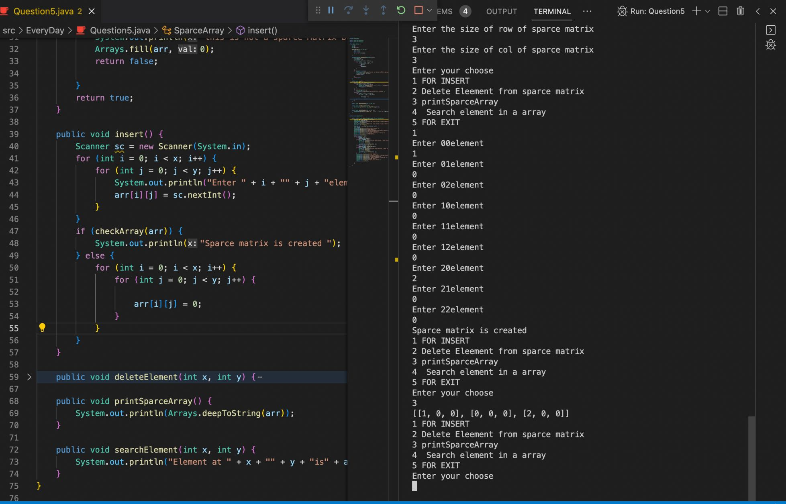
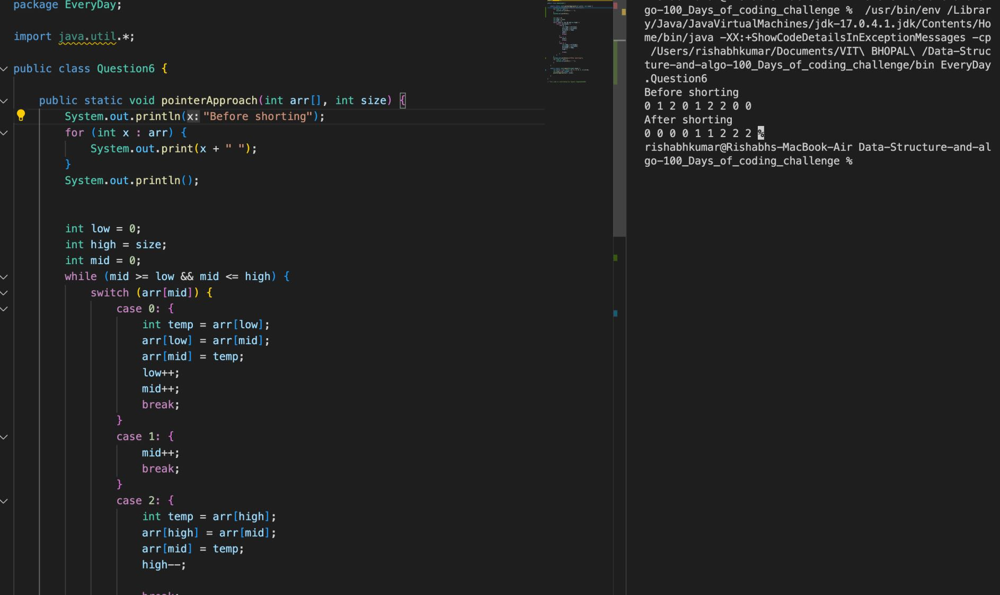

## Getting Started 100 Days challenge

Hello everyone;
Welcome to my repository regarding data structure and algorithm. This repository is accessible to all and you all can watch my everyday solutions and gain knowledge by sharing.
I am up for suggestions always :-)

## Folder Structure of this Repo
Every Question file present src Folder
-  All the files of my DSA solutions are present in everyday folder within src Folder.
Welcome to my solution mates ;-)

 

# Q1 Write a program to reverse an array or string

Given an array (or string), the task is to reverse the array/string.
 Examples :
 
 - `Input`: s = Rishabh
 - `Output`: hbahsiR
 ## My Solution
 

 # Q2 Maximum and minimum of an array using minimum number of comparisons
 Given an array of size N. The task is to find the maximum and the minimum element of the array using the minimum number of comparisons.
  - `Examples`:
  - `Input`: arr[] = {3, 5, 4, 1, 9}
 - `Output`: Minimum element is: 1
              Maximum element is: 9

- `Input`: arr[] = {22, 14, 8, 17, 35, 3}
 - `Output`:  Minimum element is: 3
              Maximum element is: 35
 ## My Solution 1 Using Linear search
 
 ## My Solution 2
 In this Solution i used `tournament method` 
 - 

  # Q4 Given an array which consists of only 0, 1 and 2. Sort the array without using any sorting algo
  Given an array of size N containing only 0s, 1s, and 2s; sort the array in ascending order.
   - `Examples`:
    - `Input`: N = 5 arr[]= {0 2 1 2 0}
 - `Output`: 0 0 1 2 2
 - `Explanation`:
0s 1s and 2s are segregated 
into ascending order.
 ## My Solution
 
 # Q5 Sparse Matrix and its representations (Using Arrays)
 A matrix is a two-dimensional data object made of m rows and n columns, therefore having total m x n values. If most of the elements of the matrix have 0 value, then it is called a sparse matrix.
 - `Example: `
 - `0 0 3 0 4  `          
 - `0 0 5 7 0`
- `0 0 0 0 0`
- `0 2 6 0 0`
## My Solution
 

 # Q6 Sort an array of 0s, 1s and 2s | Dutch National Flag problem
 ### In This question I am using the Pointer Approach: 
 - `Examples`:
   - `Input`: N = 5 
   - `arr[]`= {0 2 1 2 0}
   - `Output`: 0 0 1 2 2
## My Solution 2 Using Pointer Approach:
 

 # Q7 Move all negative numbers to beginning and positive to end with constant extra space

